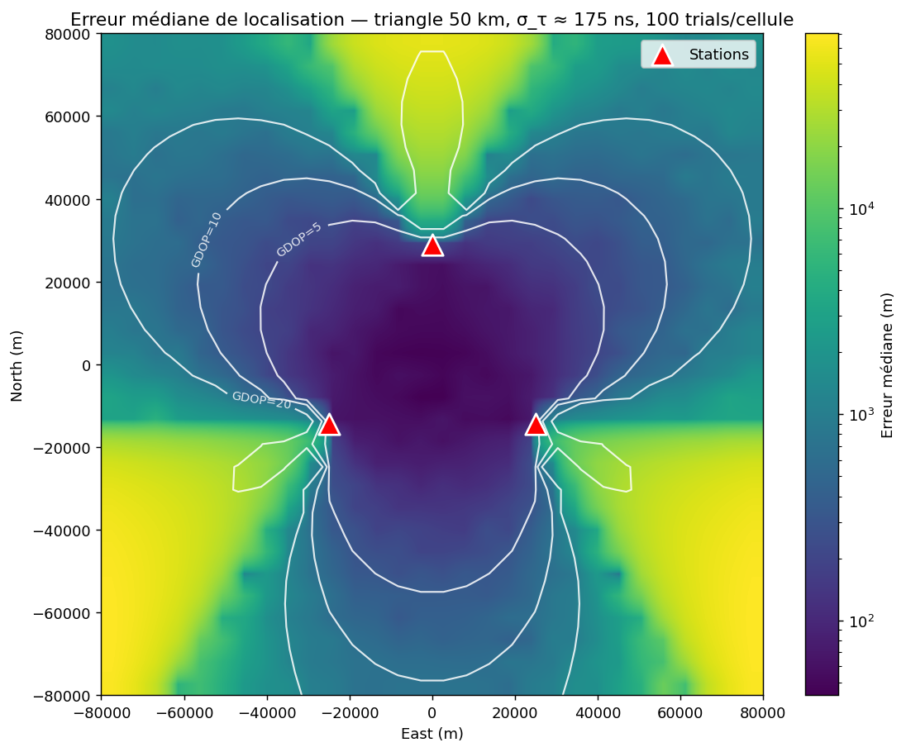
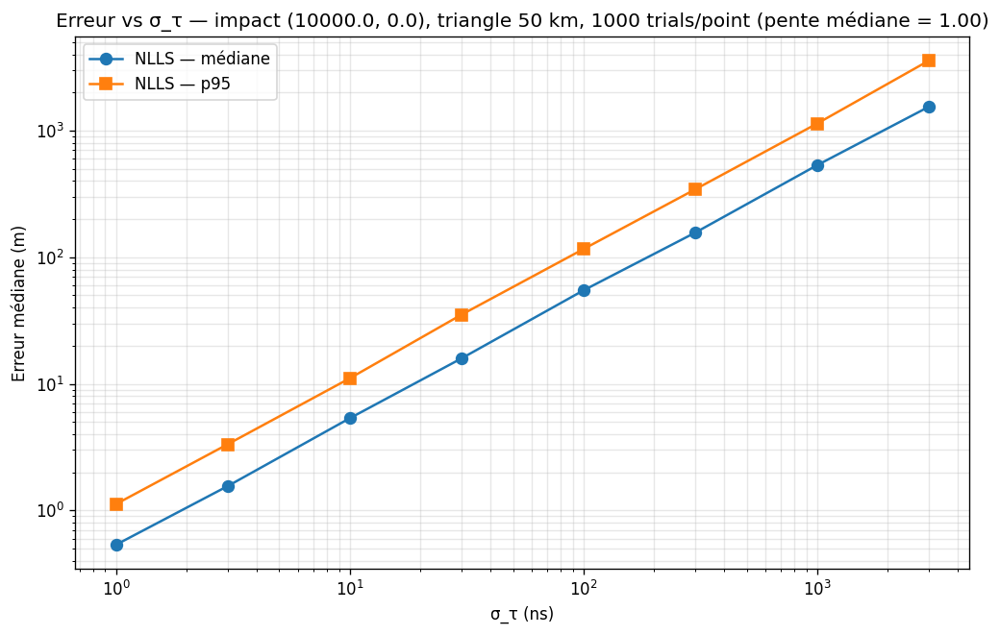
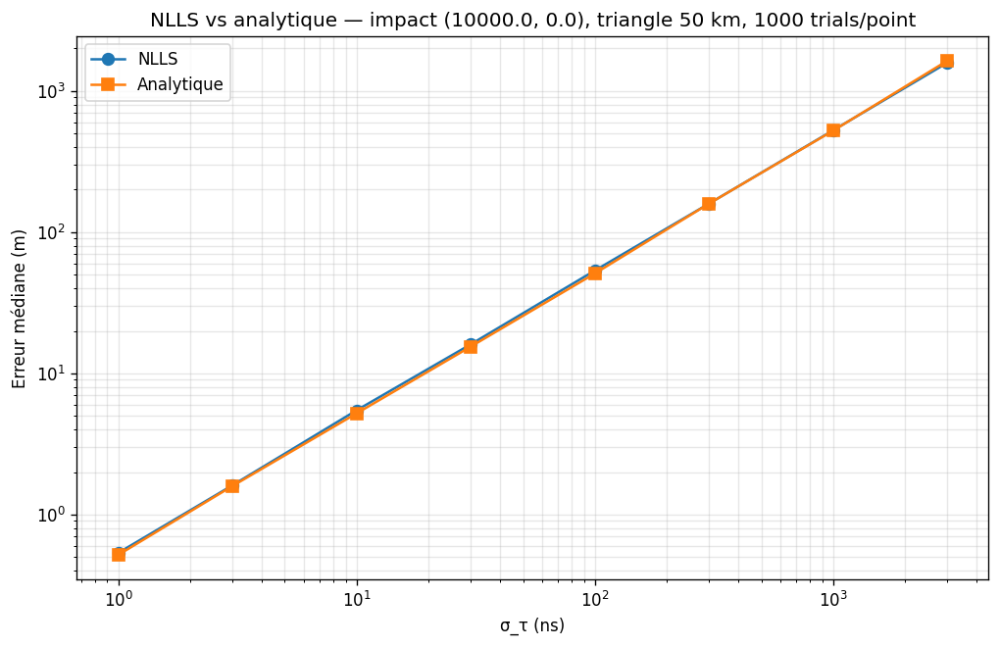
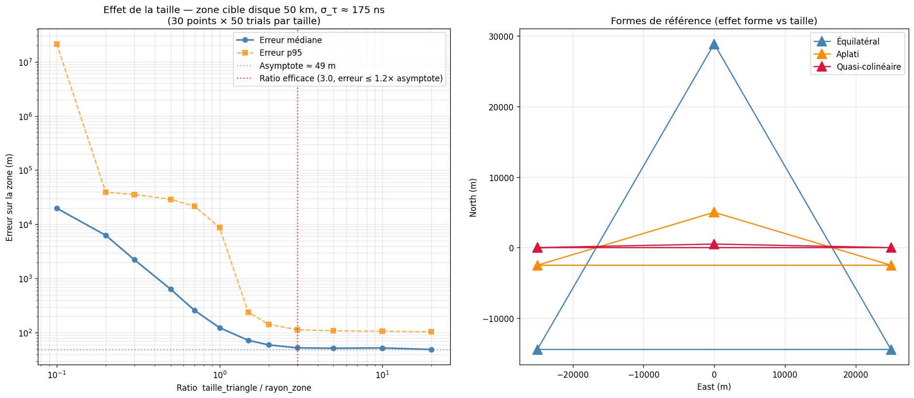

# Lightning TDOA Simulator

Software simulation of a 3-station VLF lightning detection network using time-difference-of-arrival trilateration. Pure Python, no hardware involved; the same code runs on a laptop or in the browser via WebAssembly.

**Headline result.** With three stations on a 50 km equilateral baseline and 100 ns timing noise on every channel, the median location error is **about 52 m inside the network footprint** and stays under 65 m out to the circumscribed circle.



## Quick start

```bash
git clone https://github.com/paul-des-brosses/lightning-tdoa-simulator.git
cd lightning-tdoa-simulator && pip install -e .[dev]
pytest && python experiments/bench_heatmap.py
```

The third command runs the test suite and regenerates the headline figure in `assets/`. The other three benchmarks under `experiments/` work the same way.

The interactive web demo lives in `ui/`. Open `ui/index.html` in a recent Chromium-based browser and let Pyodide warm up (~30 s on first visit, ~5 s afterwards thanks to the browser cache).

## Method

A lightning return stroke radiates a strong VLF pulse that propagates roughly at the speed of light in the Earth–ionosphere waveguide. Three time-synchronised receivers will see that pulse arrive at slightly different instants; the differences carry enough information to triangulate the source.

For a strike at position **p** and a station at **rᵢ**, the simulated time of arrival is

$$ t_i = \frac{\|\mathbf{p} - \mathbf{r}_i\|}{c} + n_i $$

where *c* is fixed at 299 792 458 m/s and *nᵢ* lumps together VLF detection jitter, GPS-disciplined clock jitter, and a per-station bias. The solver works on time *differences* relative to a reference station — the absolute origin drops out:

$$ \min_{\mathbf{p}} \; \sum_{i \neq \mathrm{ref}} \Big( \|\mathbf{p}-\mathbf{r}_i\| - \|\mathbf{p}-\mathbf{r}_{\mathrm{ref}}\| - c \, \tau_i \Big)^2 $$

Two solvers are implemented behind the same API:

- a non-linear least-squares minimiser (`scipy.optimize.least_squares`, trust-region reflective), which is the production path and extends to *N* stations;
- a closed-form intersection of the two TDOA hyperbolas, kept as a baseline and as a sanity check.

The simulation deliberately stops at the time-of-arrival level — there is no waveform synthesis or cross-correlation. The point of the project is to expose the geometric structure of TDOA, not to model the ionosphere.

### What is assumed away

- Propagation is rectilinear at constant *c*. Real VLF propagation in the Earth–ionosphere waveguide runs slightly slower and has dispersion; ignored here.
- Geometry is 2D in a local east-north tangent plane. No WGS-84, no altitude.
- Noise is Gaussian and independent across stations. There is no model of correlated ionospheric perturbations.
- Clock biases are redrawn for every Monte Carlo trial. A real campaign would lock them per station; the current model favours statistical realism over operational realism.

These choices are stated up front because they shape what the numbers below mean.

## Results

All four figures below are produced by stand-alone scripts under `experiments/` and saved to `assets/`. The numerical highlights are also written to `assets/chiffres_cles.json` so they can be picked up by other tooling without re-running the benchmarks.

### Error map across the network


Median error per cell, 100 Monte Carlo trials each, σ_VLF = σ_GPS = σ_clock = 100 ns. The error is small inside the triangle (≈ 50 m), grows along the median axes where the GDOP is highest, and remains acceptable inside the circumscribed disk. The dashed contours mark GDOP = 5, 10, 20 and roughly outline the regions of usable, marginal, and degraded geometry. The behaviour matches textbook TDOA: it is the *angle subtended* by the network, not raw distance, that drives accuracy.

### Error vs noise



Median location error against σ on the time channels, log-log. The slope is essentially 1 (fitted ≈ 0.999) over four decades — this is the linear scaling expected when the geometry is fixed. At σ = 100 ns the fix is good to about 55 m, which is the calibration point used in the heatmap above.

### NLLS vs closed-form solver



The two solvers track each other within 5 % across the whole noise range. Beyond noise behaviour, NLLS wins because (i) it generalises to *N* stations for free, and (ii) the analytical solver is genuinely brittle on noiseless inputs — the two hyperbolas cross at two points and a tie-breaker is required. NLLS is therefore the default; the analytical solver is kept for cross-checks and for its pedagogical value.

### How to size the network



For a target coverage zone of radius *Z*, varying the equilateral side over {0.1 Z, 0.3 Z, 0.5 Z, 1 Z, 2 Z, 5 Z} reveals a clear optimum at side ≈ 5 Z (≈ 52 m median error in this configuration). The practical reading: stations should be roughly as far apart as the radius of the area you want to cover, *not* clustered inside it. A small triangle has small absolute time differences, so noise dominates everywhere outside the immediate footprint.

## Live demo

The web UI is a pure static site: HTML, CSS, vanilla JS, and Pyodide. The Python library is loaded into the browser as-is — no JavaScript port. You can drag the three stations, switch noise presets, generate a storm of random strikes (Poisson timing + 2D random walk + drift), and watch detections coloured by error. Pause to compute a Monte Carlo error map over the visible area, or stop the session to download a one-page PDF report (config, key figures, captured scene).

A static deployment will be available at <https://paul-des-brosses.github.io/lightning-tdoa-simulator/> once GitHub Pages is enabled on the repository.

## Architecture

```
lightning_tdoa/
├── geometry.py    Station, ENU helpers, predefined triangles, collinearity check
├── simulator.py   Strike → noisy TOAs (VLF + GPS + per-station clock bias)
├── solver.py      NLLS solver + closed-form solver, uniform SolverResult API
├── metrics.py     Location error, GDOP, validity radius, Monte Carlo aggregates
├── storm.py       Lightning stream generator (Poisson, 2D walk, drift, wrap)
└── viz.py         Matplotlib plots and Folium HTML export

tests/             4 reference tests (identity, simulator+solver, GDOP, edges)
experiments/       Stand-alone benchmark scripts; rerun to regenerate assets/
ui/                Static web app: HTML/CSS/vanilla JS + Pyodide bridge
```

A point of design that matters: `solver.py` does not import `simulator.py`. The solver consumes a plain `dict[station_id, t_arrival]` and is agnostic about where those timestamps come from. Wiring up real receivers later means writing a new producer for that dict — nothing in the solver has to change.

## Limitations and possible extensions

- 2D geometry. The math generalises to 3D without surprises but a fourth station is needed to constrain altitude.
- No waveform synthesis. A `waveform.py` module with chirp generation and cross-correlation TDOA extraction is a natural extension and would let the noise model become physically grounded.
- The Chan algorithm (closed-form, robust under noise) would be a useful third solver to add for benchmarking — it is a known good baseline in the TDOA literature.
- The clock bias model is per-trial; for campaign-style simulations it should be per-station and carried across trials.
- The static plotting code (`viz.py`) and the live SVG renderer (`ui/svg_scene.js`) duplicate a small amount of geometry. Refactoring towards a single source of truth is on the to-do list.

## License

Released under the MIT license. See [LICENSE](LICENSE).
